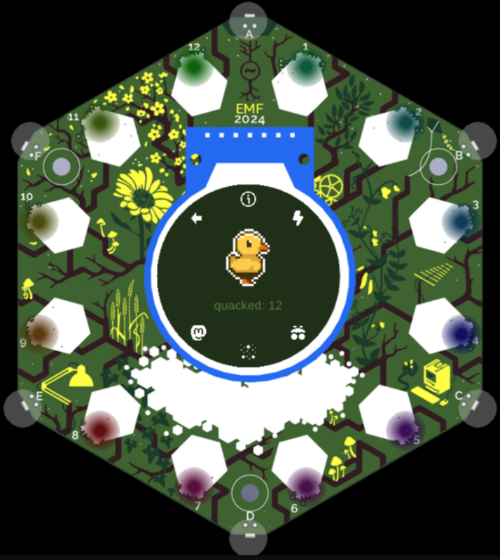
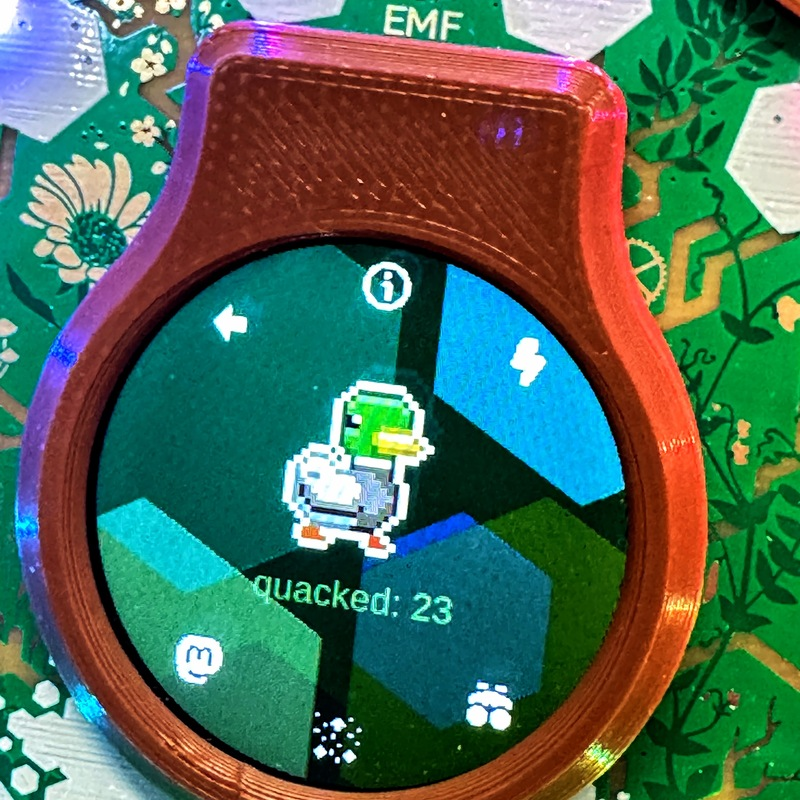

# Duck Facts

An app for the [Tildagon](tildagon.badge.emfcamp.org) badge (the badge of Electromagnetic Field 2024 onwards).

Some facts about ducks 🦆

Inspired by [@emfducks](https://mastodon.social/@emfducks) (but not endorsed by them).

Wants to be on wifi to grab facts and hunt for duck images, but has some offline content for when you just need a duck fix.

Enjoy several modes of ducky fun:

- Duck Fact
- Duck Hunt
- Duck Party
- Duck Toot

Shake it! Explore it! Save your favourite facts! Check out @emfducks' latest quack!

This app has nothing to do with the following image (but, a fully-functional duck #hexpansion must clearly be created).

## Build tools

| Script | Run with | What it does |
|---|---|---|
| `tools/fetch_assets.py` | `uv run tools/fetch_assets.py` | Downloads facts, @emfducks avatar (100×100 JPEG), builds QR sprite |
| `tools/encode_sprites.py` | `uv run tools/encode_sprites.py` | Encodes all 3 duck families → 10 gzip JSON animation files |
| `tools/encode_icons.py` | `uv run tools/encode_icons.py` | Converts SVGs via rsvg-convert → gzip JSON icon sprites (system dep: `dnf install librsvg2-tools`) |

## Credit and data sources

- Huge thanks to caz-bee for the fantastic [duck sprite assets](https://caz-bee.itch.io/), which made the cute duck animations possible.
- Thanks to starwatchers-studio for the [rubber duck](https://starwatchers-studio.itch.io/rubber-duck) as well.

- Button icons via [Flaticon](https://www.flaticon.com/).

- Live fact data from the [duck facts API](https://03vpefsitf.execute-api.eu-west-1.amazonaws.com/prod/) (thank you to whoever is still running this!).
- Live duck images from <https://ducks.now/> and <https://random-d.uk/>, via <https://wsrv.nl/> for resizing.
- Stored/local fact data from [bjorn-knudsen duck facts bot](https://github.com/bjorn-knudsen/duck-facts-bot/blob/main/duck_facts.txt).

## LICENSE

MIT

## Contributions

Yes, please.
